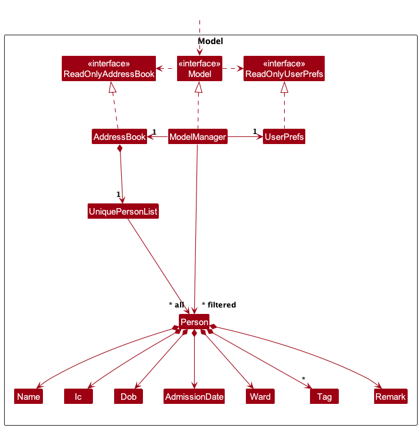
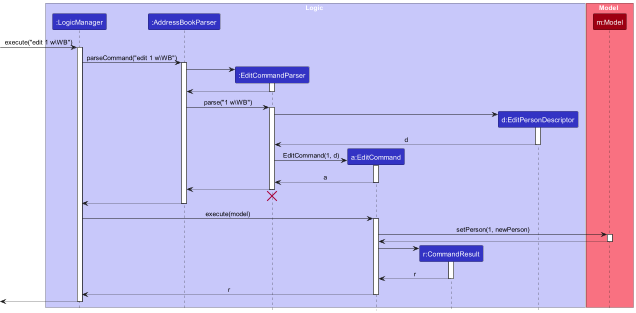
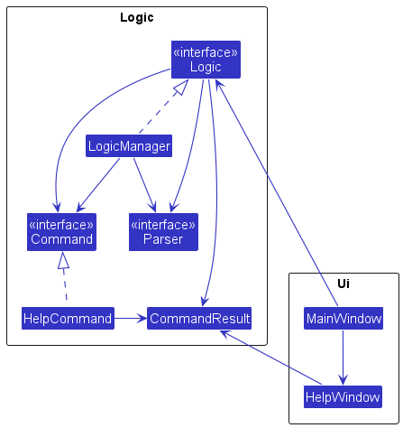
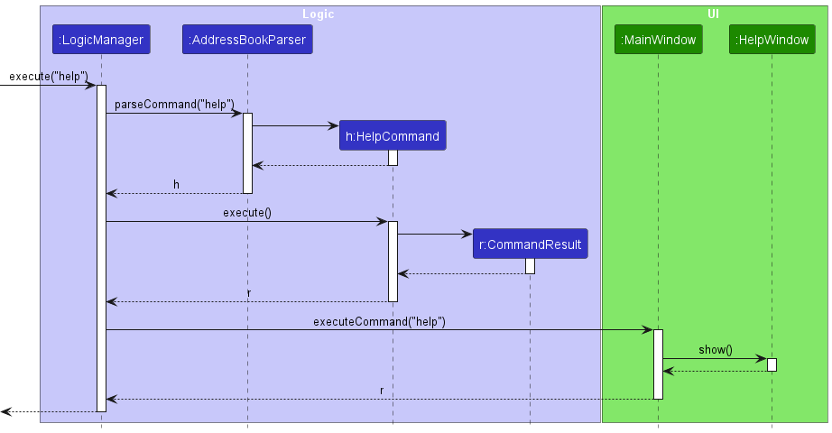
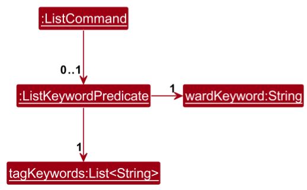
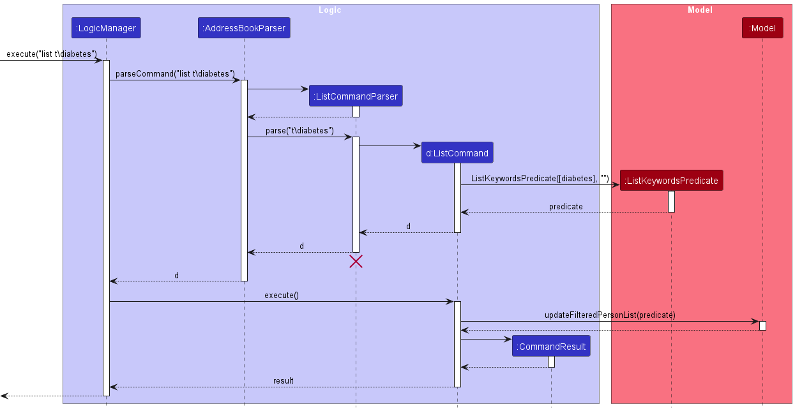
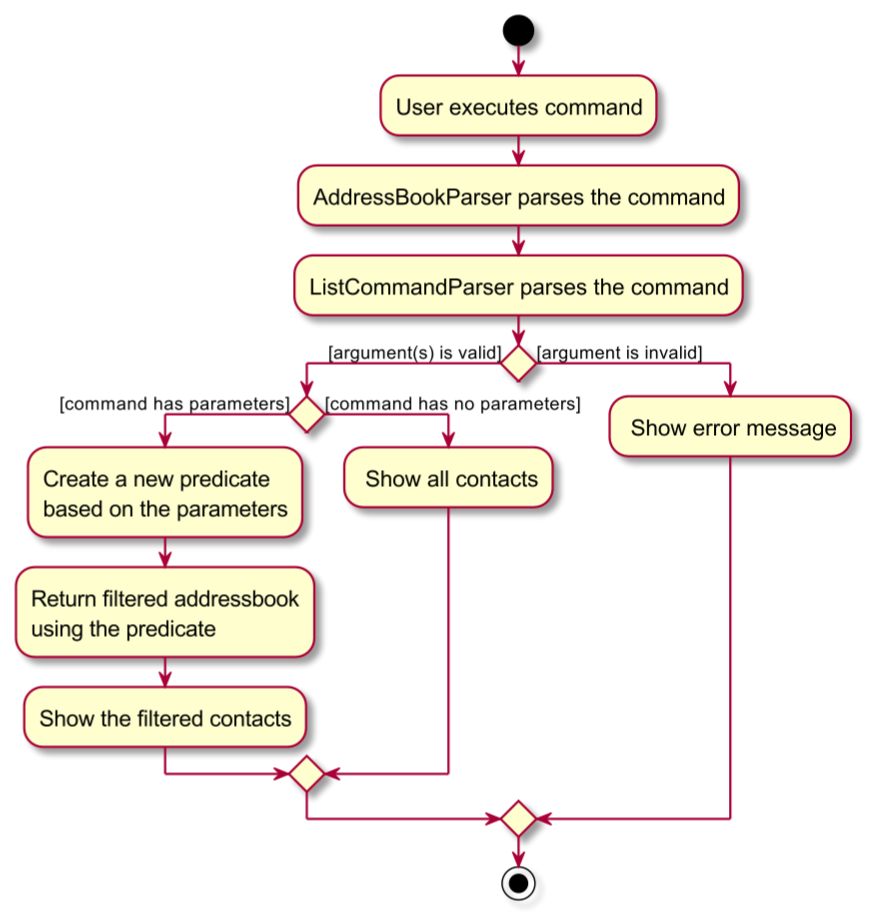
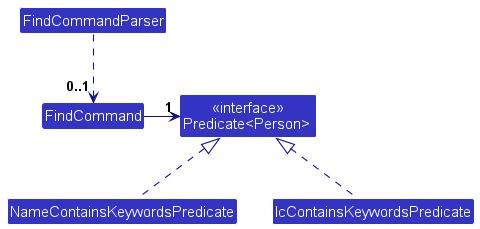

* Table of Contents
{:toc}

--------------------------------------------------------------------------------------------------------------------

## **Acknowledgements**

* Libraries used: [JavaFX](https://openjfx.io/), [JUnit5](https://github.com/junit-team/junit5), [Jackson](https://github.com/FasterXML/jackson)
* The [original AB3 project](https://github.com/se-edu/addressbook-level3), which Nursing Address Book is based from.
--------------------------------------------------------------------------------------------------------------------

## **Setting up, getting started**

Refer to the guide [_Setting up and getting started_](SettingUp.md).

--------------------------------------------------------------------------------------------------------------------

## **Design**

### Architecture

The ***Architecture Diagram*** given above explains the high-level design of the App.

Given below is a quick overview of main components and how they interact with each other.

**Main components of the architecture**

**`Main`** (consisting of classes [`Main`](https://github.com/AY2324S2-CS2103T-F10-1/tp/blob/master/src/main/java/seedu/address/Main.java) and [`MainApp`](https://github.com/AY2324S2-CS2103T-F10-1/tp/blob/master/src/main/java/seedu/address/MainApp.java) is in charge of the app launch and shut down.
* At app launch, it initializes the other components in the correct sequence, and connects them up with each other.
* At shut down, it shuts down the other components and invokes cleanup methods where necessary.

The bulk of the app's work is done by the following four components:

* [**`UI`**](#ui-component): The UI of the App.
* [**`Logic`**](#logic-component): The command executor.
* [**`Model`**](#model-component): Holds the data of the App in memory.
* [**`Storage`**](#storage-component): Reads data from, and writes data to, the hard disk.

[**`Commons`**](#common-classes) represents a collection of classes used by multiple other components.

**How the architecture components interact with each other**

The *Sequence Diagram* below shows how the components interact with each other for the scenario where the user issues the command `delete 1`.

Each of the four main components (also shown in the diagram above),

* defines its *API* in an `interface` with the same name as the Component.
* implements its functionality using a concrete `{Component Name}Manager` class (which follows the corresponding API `interface` mentioned in the previous point.

For example, the `Logic` component defines its API in the `Logic.java` interface and implements its functionality using the `LogicManager.java` class which follows the `Logic` interface. Other components interact with a given component through its interface rather than the concrete class (reason: to prevent outside component's being coupled to the implementation of a component), as illustrated in the (partial) class diagram below.

The sections below give more details of each component.

### UI component

The **API** of this component is specified in [`Ui.java`](https://github.com/AY2324S2-CS2103T-F10-1/tp/blob/master/src/main/java/seedu/address/ui/Ui.java)

The UI consists of a `MainWindow` that is made up of parts e.g.`CommandBox`, `ResultDisplay`, `PersonListPanel`, `StatusBarFooter` etc. All these, including the `MainWindow`, inherit from the abstract `UiPart` class which captures the commonalities between classes that represent parts of the visible GUI.

The `UI` component uses the JavaFx UI framework. The layout of these UI parts are defined in matching `.fxml` files that are in the `src/main/resources/view` folder. For example, the layout of the [`MainWindow`](https://github.com/AY2324S2-CS2103T-F10-1/tp/blob/master/src/main/java/seedu/address/ui/MainWindow.java) is specified in [`MainWindow.fxml`](https://github.com/AY2324S2-CS2103T-F10-1/tp/blob/master/src/main/resources/view/MainWindow.fxml)

The `UI` component,

* executes user commands using the `Logic` component.
* listens for changes to `Model` data so that the UI can be updated with the modified data.
* keeps a reference to the `Logic` component, because the `UI` relies on the `Logic` to execute commands.
* depends on some classes in the `Model` component, as it displays `Person` object residing in the `Model`.

### Logic component

**API** : [`Logic.java`](https://github.com/AY2324S2-CS2103T-F10-1/tp/blob/master/src/main/java/seedu/address/logic/Logic.java)

Here's a (partial) class diagram of the `Logic` component:

The sequence diagram below illustrates the interactions within the `Logic` component, taking `execute("delete 1")` API call as an example.

<b markdown="span" class="alert alert-info">:information_source: <b>Note:</b> The lifeline for `DeleteCommandParser` should end at the destroy marker (X) but due to a limitation of PlantUML, the lifeline continues till the end of diagram.

How the `Logic` component works:

1. When `Logic` is called upon to execute a command, it is passed to an `AddressBookParser` object which in turn creates a parser that matches the command (e.g., `DeleteCommandParser`) and uses it to parse the command.
1. This results in a `Command` object (more precisely, an object of one of its subclasses e.g., `DeleteCommand`) which is executed by the `LogicManager`.
1. The command can communicate with the `Model` when it is executed (e.g. to delete a person). 
   Note that although this is shown as a single step in the diagram above (for simplicity), in the code it can take several interactions (between the command object and the `Model`) to achieve.
1. The result of the command execution is encapsulated as a `CommandResult` object which is returned back from `Logic`.

Here are the other classes in `Logic` (omitted from the class diagram above) that are used for parsing a user command:

How the parsing works:
* When called upon to parse a user command, the `AddressBookParser` class creates an `XYZCommandParser` (`XYZ` is a placeholder for the specific command name e.g., `AddCommandParser`) which uses the other classes shown above to parse the user command and create a `XYZCommand` object (e.g., `AddCommand`) which the `AddressBookParser` returns back as a `Command` object.
* All `XYZCommandParser` classes (e.g., `AddCommandParser`, `DeleteCommandParser`, ...) inherit from the `Parser` interface so that they can be treated similarly where possible e.g, during testing.

### Model component
**API** : [`Model.java`](https://github.com/AY2324S2-CS2103T-F10-1/tp/blob/master/src/main/java/seedu/address/model/Model.java)

The `Model` component,

* stores the address book data i.e., all `Person` objects (which are contained in a `UniquePersonList` object).
* stores the currently 'selected' `Person` objects (e.g., results of a search query) as a separate _filtered_ list which is exposed to outsiders as an unmodifiable `ObservableList<Person>` that can be 'observed' e.g. the UI can be bound to this list so that the UI automatically updates when the data in the list change.
* stores a `UserPref` object that represents the user’s preferences. This is exposed to the outside as a `ReadOnlyUserPref` objects.
* does not depend on any of the other three components (as the `Model` represents data entities of the domain, they should make sense on their own without depending on other components)

### Storage component

**API** : [`Storage.java`](https://github.com/AY2324S2-CS2103T-F10-1/tp/blob/master/src/main/java/seedu/address/storage/Storage.java)

The `Storage` component,
* can save both address book data and user preference data in JSON format, and read them back into corresponding objects.
* inherits from both `AddressBookStorage` and `UserPrefStorage`, which means it can be treated as either one (if only the functionality of only one is needed).
* depends on some classes in the `Model` component (because the `Storage` component's job is to save/retrieve objects that belong to the `Model`)

### Common classes

Classes used by multiple components are in the `seedu.addressbook.commons` package.

--------------------------------------------------------------------------------------------------------------------

## **Implementation**

This section contains some noteworthy details on how certain features are being implemented.

### Adding a patient into Nursing Address Book

#### Implementation

The add patient feature is facilitated by `AddCommand`, `AddCommandParser` and `LogicManager`.

Given below is an example usage scenario and how the add patient feature behaves at each step.

Step 1. The user inputs an add Command (e.g. `add n\Alice ic\A0055679T ad\01/01/2022 dob\01/01/2002 w\WA`) to add a new patient named Alice to the address book.

:information_source: **Note:** The format of the add command is as follows:
n\: Indicates the name of the patient
ic\: Indicates the NRIC of the patient
ad\: Indicates the admission date of the patient
dob\: Indicates the date of birth of the patient
w\: Indicates the ward of the patient is currently in
r\: Indicates remarks for the patient (optional)
t\: Indicates the tags of the patient (optional, can have multiple)

Step 2. The `add` command calls `AddCommandParser#parse(String)` to parse the user input and creates a new `AddCommand` object.

Step 3. The created `AddCommand` is returned to `LogicManager`. Then, `AddCommand` is executed by calling `AddCommand#execute(Model)`.

Step 4. The `AddCommand#execute(Model)` then calls `Model#addPerson(Person)` to add the new patient to the address book.

Step 5. The `CommandResult` from the `AddCommand` object is returned to `LogicManager` and then to `UI` to display the success message.

**UML Diagrams:**

The following sequence diagram summarizes what happens when a user executes a new command:

### Editing a patient's details

#### Implementation

Editing a patient's details is facilitated by `EditCommand`, `EditCommandParser` and `LogicManager`.

Given below is an example usage scenario and how the edit patient feature behaves at each step.

Step 1. The user inputs an edit Command (e.g. `edit 1 w\WB`) to edit the ward of the patient at index 1 in Nursing Address Book.

Step 2. The `edit` command calls `EditCommandParser#parse(String)` to parse the user input. 

Step 3. A new `EditPersonDescriptor` object is created with the new ward details. 
A new `EditCommand` instance will be created with the index of the patient to be edited and the new `EditPersonDescriptor` object.

Step 4. The `EditCommand` instace is returned to the `LogicManager` and `execute` is called.

Step 5. The `EditCommand` instance calls `Model#setPerson(Person, Person)` to edit the patient's details.
The patient specified will have its ward updated to the new ward specified.

**UML Diagrams:**

The following sequence diagram summarizes what happens when a user executes a new command:

### Showing help for commands

#### Implementation

The help command is facilitated by the `HelpCommand` class. It allows users to view the usage instructions for the application.

The `HelpCommand` class extends the `Command` interface and is responsible for executing the `help` command. It creates a `CommandResult` object with the help message to be displayed to the user.

**UML Diagrams:**

The following class diagram shows the relevant classes involved in the help command implementation:

Step 1. The `LogicManager` is called to execute the "help" command.
Step 2. The `AddressBookParser` parses the command and creates a new `HelpCommand` instance.
Step 3. The `LogicManager` calls the `execute()` method of the `HelpCommand`.
Step 4. The `HelpCommand` creates a new `CommandResult` with the help message.
Step 5. The `MainWindow` handles the help command and calls the `handleHelp()` method.
Step 6. The `ResultDisplay` is updated with the help message obtained from `HelpCommand.SHOWING_HELP_MESSAGE`.

The `HelpCommand` class interacts with the `Logic` component and utilizes the `CommandResult` class to encapsulate the result of executing the `help` command. The `MainWindow` and `ResultDisplay` classes in the UI component are responsible for handling the display of the help message to the user.

The following sequence diagram shows how the help command works:

The following activity diagram summarizes what happens when a user executes a new command:

When the user executes the help command, the following steps occur:
  

1. The `LogicManager` is called to execute the "help" command.
2. The `AddressBookParser` parses the command and creates a new `HelpCommand` instance.
3. The `LogicManager` calls the `execute()` method of the `HelpCommand`.
4. The `HelpCommand` creates a new `CommandResult` with the help message.
5. The `MainWindow` handles the help command and calls the `handleHelp()` method.
6. The `ResultDisplay` is updated with the help message obtained from `HelpCommand.SHOWING_HELP_MESSAGE`.

The `HelpCommand` class interacts with the `Logic` component and utilizes the `CommandResult` class to encapsulate the result of executing the `help` command. The `MainWindow` and `ResultDisplay` classes in the UI component are responsible for handling the display of the help message to the user.

### Add a patient

#### Implementation

The add patient feature is facilitated by `AddCommand`, `AddCommandParser` and `Person`.

Given below is an example usage scenario and how the add patient feature behaves at each step.

Step 1. The user launches the application for the first time.

Step 2. The user executes an Add Command (e.g. 'add n\Alice ic\A0055679T ad\01/01/2022 dob\01/01/2002 w\WA') to add a new patient to the address book.

n\: Indicates the name of the patient
ic\: Indicates the NRIC of the patient
ad\: Indicates the admission date of the patient
dob\: Indicates the date of birth of the patient
w\: Indicates the ward of the patient is currently in

The `AddCommandParser` parses the user input, creating a new `AddCommand` object.
The `AddCommand` object then creates a new `Person` object with the parsed details.

### List with filter by tags and/or ward feature
#### Introduction
This section describes the implementation of the list with filter by tags and/or ward mechanism in NAB. This mechanism 
allows users to list patients based on their tags and/or ward, on top of listing all patients. This feature is useful 
for nurses to quickly find patients with specific medical conditions or patients in a specific ward.

#### Implementation

The filter by tags and/or ward mechanism is facilitated by `ListCommand`, `ListCommandParser`, `ListKeywordsPredicate`
and `LogicManager`, which implements the `Logic` interface. `LogicManager` holds a `AddressBookParser` that parses the 
user input, and a model where the command is executed. Additionally, it implements the following operations:

* `LogicManager#execute(String)`— Executes the given user String input to return a `CommandResult` object.

These operations are exposed in the UI interface as `MainWindow#executeCommand(String)`.

Given below is an example usage scenario and how the filter by tags and/or ward mechanism behaves at each step.

Step 1. The user executes `list t\diabetes` command to list patients with the diabetes tag in the address book. 
- The `list` command triggers `AddressBookParser` to parse the user input, identifying the `list` command word to call
`ListCommandParser#parse(String)` to parse the rest of the user input.

Step 2. `ListCommandParser#parse(String)` parses the user input. If there are subsequent arguments, a 
`ListKeywordPredicate` object is created with the keyword(s) provided. The keywords can be either a ward or tag(s) or both,
supplied by the user with the relevant prefix. In this case, it would be a tag, `t\diabetes`.

Step 3. A new `ListCommand` instance is created using the `ListKeywordsPredicate` object. (If there are no parameters 
provided, it will still simply create a `ListCommand` object.)

The following is a list of objects created thus far:

Step 4. The `ListCommand` object is returned to `LogicManager` and `execute` is called. `ListCommand#execute(Model)` 
filters the list of patients in `Model` based on the `ListKeywordsPredicate` object if it is present. (Otherwise, it 
returns the full list of patients.)

Step 5. The filtered list of patients (with diabetes) is displayed to the user through the GUI.

**UML Diagrams:**

The following sequence diagram shows how the listing of relevant patients would work:

The following activity diagram summarizes what happens when a user executes a new command to list relevant patients:

#### Design considerations:

**Aspect: Command to filter:**

* **Alternative 1 (current choice):** Add the parameters to list command instead of find.
    * Pros: More appropriate as `list` will produce a useful list of relevant contacts, whereas `find` implies that only one useful result is expected.
    * Cons: May not have such a clear distinction between `list` and `find`, as user just wants to search for results.

* **Alternative 2:** Add parameters to find command instead of list.
    * Pros: Easy to use, one command will perform all search.
    * Cons: Unable to differentiate usefulness.

**Aspect: Filter by a ward or many wards:**

* **Alternative 1 (current choice):** Allow filtering only by at most 1 ward input.
    * Pros: More targeted; Nurses will only refer to the ward that they are in or are visiting. Otherwise, will filter across all wards.
    * Cons: Does not allow looking at specific, multiple wards.

* **Alternative 2:** Allow multiple ward tags.
    * Pros: Easy to be more specific.
    * Cons: Not relevant for the nurses use case. Allowing more wards also make it harder to filter fast.

### Find feature

#### Implementation

The filter by tags and/or ward mechanism is facilitated by `FindCommand`, `FindCommandParser`,
`NameContainsKeywordsPredicate` and
`IcContainsKeywordsPredicate`.

Additionally, it implements the following operations:

* `FindCommandParser#parse()` — Parses user input and creates a `FindCommand` object.

Given below is an example usage scenario and how the find by name or IC mechanism behaves at each step.

Step 1. The user executes `find n\Bob` command to find patient with the name Bob in the address book. The
`FindCommandParser` parses the user input, creating a new `FindCommand` and `NameContainsKeywordsPredicate` object.

Step 2. For each patient in the address book, the `predicate` object will be passed to
`Model#updateFilteredPersonList` check if the patient has Bob as part of his/her name. If the patient has the name Bob,
the patient will be shown in result.

#### Design considerations:

**Aspect: Find by full word or letters:**

* **Alternative 1 (current choice):** Allow finding by full word only.
    * Pros: More meaningful to find by words instead of just letters.
    * Cons: Harder to search when patient details is insufficient.

* **Alternative 2:** Allow finding by letters.
    * Pros: Able to search even if lacking patient information.
    * Cons: Harder to get specific patient as result will be a list.

--------------------------------------------------------------------------------------------------------------------

## **Documentation, logging, testing, configuration, dev-ops**

* [Documentation guide](Documentation.md)
* [Testing guide](Testing.md)
* [Logging guide](Logging.md)
* [Configuration guide](Configuration.md)
* [DevOps guide](DevOps.md)

--------------------------------------------------------------------------------------------------------------------

## **Appendix: Requirements**

### Product scope

**Target user profile**:
Ward nurses
* manage a significant number of patient contacts with varying details
* quickly access critical patient information in time-sensitive situations
* track and log details of care administered to each patient over time

**Preferences/ Skills**
* prefer desktop apps over other types
* can type fast
* prefers typing to mouse interactions
* is reasonably comfortable using CLI (command-line interface) apps

**Value proposition**: streamlined text-based commands to manage contacts faster than a typical mouse/GUI driven app

### User stories

Priorities: High (must have) - `* * *`, Medium (nice to have) - `* *`, Low (unlikely to have) - `*`

| Priority | As a …​                                | I want to …​                                | So that I can…​                                              |
| ---- | -------------------------------------- |---------------------------------------------|--------------------------------------------------------------|
| `* * *` | user                                   | add patient records                      | keep track of their medical condition in the hospital        |
| `* * *` | user                                   | view existing patient records               | access information on existing patients                      |
| `* * *` | user                                   | delete a patient record                     | remove outdated or irrelevant patient data                   |
| `* *` | user                                   | edit patient records                        | ensure that all patient details are current and accurate     |
| `* *` | user                                   | list patients based on their tags           | view patients based on category                              |
| `* *` | user                                   | list all patients tied to a specific ward   | know which patients belong to which ward                     |
| `* *` | user                                   | find patients via their name or NRIC        | quickly find information of specific patient                 |
| `* *` | user                                   | access the user guide through the app easily | learn how to use the Nursing Address Book                    |
| `*`  | user                                   | view patient list sorted by name            | look through the list of patients in a more organized manner |

### Use cases

(For all use cases below, the **System** is the `Nursing Address Book` and the **Actor** is the `user`, unless 
specified otherwise)

**Use case: UC01 - View all patient records**

**MSS**

1.  User requests to list patients.
2.  Nursing Address Book shows a list of patients.

    Use case ends.

**Extensions**

* 1a. Nursing Address Book detects that the command is invalid. 
  * 1a1. Nursing Address Book shows an error message.

  Use case resumes at step 1.

**Use case: UC02 - Add a patient**

**MSS**

1.  User requests to add a patient.
2.  Nursing Address Book adds the patient.
3.  Nursing Address Book shows success message to the user.

    Use case ends.

**Extensions**

* 1a. Nursing Address Book detects that the patient details is invalid.
    * 1a1. Nursing Address Book shows an error message.
    
    Use case resumes at step 1.

**Use case: US03 - Delete a patient**

**MSS**

1.  User requests to view patient records(UC01).
2.  User requests to delete a patient in the list.
3.  Nursing Address Book deletes the person.
4.  Nursing Address Book shows success message to the user.

    Use case ends.

**Extensions**

* 2a. The given index is invalid.
  * 2a2. AddressBook shows an error message.

    Use case resumes at step 2.

**Use case: US04 - Edit a patient records**

**MSS**

1.  User requests to view patient records(UC01).
2.  User requests to edit a patient's record in the list.
3.  Nursing Address Book edits the patient's record.
4.  Nursing Address Book shows success message to the user.

    Use case ends.

**Extensions**

* 2a. Nursing Address Book detects that the patient details is invalid.
    * 2a1. Nursing Address Book shows an error message.

      Use case resumes at step 2.

**Use case: US05 - Find patient**

**MSS**

1. User requests to find a patient in the list. 
2. Nursing Address Book shows the patient.

    Use case ends.

**Extensions**

* 1a. Nursing Address Book detects that the given parameter is invalid.
    * 1a1. Nursing Address Book shows an error message.

      Use case resumes at step 1.

**Use case: US06 - View patient with specific tags**

**MSS**

1. User requests to view patients with specific tags.
2. Nursing Address Book shows the patient list.

   Use case ends.

**Extensions**

* 1a. Nursing Address Book detects that the given parameter is invalid.
    * 1a1. Nursing Address Book shows an error message.

      Use case resumes at step 1.

**Use case: US07 - View patients in specific ward**

**MSS**

1. User requests to view patients in specific ward.
2. Nursing Address Book shows the patient.

   Use case ends.

**Extensions**

* 1a. Nursing Address Book detects that the given parameter is invalid.
    * 1a1. Nursing Address Book shows an error message.

      Use case resumes at step 1.

**Use case: US08 - Get help with command usage**

**MSS**

1. User requests to get help with command usage.
2. Nursing Address Book shows command usage.

   Use case ends.

**Extensions**

* 1a. Nursing Address Book detects that the command is invalid.
    * 1a1. Nursing Address Book shows an error message.

      Use case resumes at step 1.

### Non-Functional Requirements

1.  Should work on any _mainstream OS_ as long as it has Java `11` or above installed.
2.  Should be able to hold up to 1000 persons without a noticeable sluggishness in performance for typical usage.
3.  A user with above average typing speed for regular English text (i.e. not code, not system admin commands) should be able to accomplish most of the tasks faster using commands than using the mouse.
4.  The user interface should be intuitive and easy to navigate.
5.  The codebase should be well-structured and well-documented to facilitate future maintenance and enhancements.
6.  The application should only support a single user.
7.  The product needs to be developed in a breadth-first incremental manner over the project duration.
8.  The data should be stored locally and should be in a human editable text file.
9.  The software should follow the Object-oriented paradigm primarily.
10.  The software should work without requiring an installer.
11.  The software should not depend on a specific remote server.
12.  The GUI should work well for standard screen resolutions 1920x1080 and higher, and, for screen scales 100% and 125%.
13.  The GUI should be usable (i.e., all functions can be used even if the user experience is not optimal) for,
     resolutions 1280x720 and higher, and, for screen scales 150%.
14.  The product should be available as a single JAR file of size 100MB or below.
15.  The web documents saved should be a PDF file of size 15MB or below.
16.  The final JAR/PDF files should not be bloated unnecessarily.
17.  The DG and UG should be PDF-friendly, without any expandable panels, embedded videos, animated GIFs etc.
18.  The use of third-party frameworks/libraries/services is allowed only if they, are free, open-source (this
     doesn't apply to services), and have permissive license terms; do not require any installation by the user; do
     not violate other constraints.
19.  The product should process a user input command within 1 second.
20.  The system must perform without failure in 95 percent of use cases during a month.

### Glossary

* **Mainstream OS**: Windows, Linux, Unix, MacOS
* **Patient**: A person receiving medical services at a hospital
* **NRIC**: Identity card number of the National Registration Identity Card, used as the primary means of 
  identification for patients in Nursing Address Book

--------------------------------------------------------------------------------------------------------------------

## **Appendix: Instructions for manual testing**

Given below are instructions to test the app manually.

[//]: # (
:information_source: **Note:** These instructions only provide a starting point for testers to work on;)

[//]: # (testers are expected to do more *exploratory* testing)

[//]: # (
)

### Launch and shutdown

1. Initial launch

    1. Download the jar file and copy into an empty folder
    2. Double-click the jar file  
       Expected: Shows the GUI with a set of sample contacts. The window size may not be optimum.

2. Saving window preferences

    1. Resize the window to an optimum size. Move the window to a different location. Close the window.
    2. Re-launch the app by double-clicking the jar file. 
       Expected: The most recent window size and location is retained.

### Adding a patient

1. Adding a patient

    1. Prerequisites: There exist no patient with NRIC `A1234567B` in the patient records.

    2. Test case (Valid parameters): `add n\John Smith ic\A1234567B dob\01/01/2000 ad\02/02/2020 w\a1 t\diarrhea
       r\likes to go to the park` 
       Expected: Patient successfully added into patient list. Details of the added patient shown in the status bar.

    3. Test case (Missing parameter): `add n\John Smith` 
       Expected: No patient is added. Error details shown in the status bar.

    4. Test case (Invalid Name): `add n\ ic\A1234567B dob\01/01/2000 ad\02/02/2020 w\a1 t\diarrhea r\likes to go to the park` 
       Expected: Similar to previous.

    5. Test case (Invalid NRIC): `add n\John Smith ic\A12347B dob\01/01/2000 ad\02/02/2020 w\a1 t\diarrhea r\likes to go to the park` 
       Expected: Similar to previous.

    6. Test case (Invalid Date of Birth): `add n\John Smith ic\A1234567B dob\2000 ad\02/02/2020 w\a1 t\diarrhea r\likes to go to the park` 
       Expected: Similar to previous.

    7. Test case (Repeated Parameter): `add n\John Smith ic\A1234567B ic\A1234567B dob\01/01/2000 ad\02/02/2020 w\a1
       t\diarrhea r\likes to go to the park` 
       Expected: Similar to previous.

    8. Test case (Date of Birth after Admission Date): `add n\John Smith ic\A1234567B dob\03/03/2000 ad\01/01/1999 w\a1` 
       Expected: Similar to previous.

### Viewing patients

1. Viewing all patients

    1. Prerequisites: Multiple patients in the patient list.

    2. Test case: `list` 
       Expected: List of patients is shown.

    3. Test case: `list 181` or any command with extra characters supplied 
       Expected: Similar to previous.

2. Viewing patients by tags and ward

    1. Prerequisites: Multiple patients in the patient list.

    1. Test case: `list tag\diarrhea w\a1` 
       Expected: List of patients is shown.

    1. Test case: `list t\diarrhea` 
       Expected: List of patients is shown.

    1. Test case: `list w\a1` 
       Expected: List of patients is shown.

### Editing a patient

1. Edit a patient while all patients are being shown

    1. Prerequisites: List all patients using the `list` command. Multiple patients in the list.

    1. Test case: `edit 1 n\John` 
       Expected: Name of first patient is changed. Details of the edited patient is shown in the status bar.

    1. Test case: `edit 1 ic\W9876543M` 
       Expected: NRIC of first patient is changed. Details of the edited patient is shown in the status bar.

    1. Test case: `edit 1 dob\03/03/2005` 
       Expected: Date of birth of first patient is changed. Details of the edited patient is shown in the status bar.

    1. Test case: `edit 1 ad\05/05/2021` 
       Expected: Admission date of first patient is changed. Details of the edited patient is shown in the status bar.

    1. Test case: `edit 1 t\flu r\afraid of darkness` 
       Expected: tag and remark of first patient is changed. Details of the edited patient is shown in the status bar.

    2. Test case (Invalid Index): `edit x n\John` where x is larger than list size  
       Expected: Error details shown in status bar.

    1. Test case (Invalid Name): `edit 1 n\ ` 
       Expected: Patient name is not changed. Error details shown in the status bar.

    2. Test case (Invalid NRIC): `edit 1 ic\a1231234b` 
       Expected: Patient NRIC is not changed. Error details shown in the status bar.

    3. Test case (Invalid Date of Birth): `edit 1 dob\03-03-2004` 
       Expected: Patient Date of Birth is not changed. Error details shown in the status bar.

    4. Test case (Invalid Admission Date): `edit 1 ad\04-02-2024 ` 
       Expected: Patient Admission Date is not changed. Error details shown in the status bar.

    5. Test case (Date of Birth after Admission Date): `edit 1 dob\03/03/2024 ad\01/01/2024 ` 
       Expected: Patient Date of Birth and Admission Date is not changed. Error details shown in the status bar.

    6. Test case (Invalid Ward): `edit 1 w\B-1 ` 
       Expected: Patient ward is not changed. Error details shown in the status bar.

### Finding a patient

1. Finding a patient by name

    1. Prerequisites: There exist only 1 patient `John Smith` in the patient records.

    1. Test case: `find n\John Smith` 
       Expected: `John Smith` is shown.

    1. Test case: `find n\john` 
       Expected: Similar to previous.

    1. Test case: `find n\Smith` 
       Expected: Similar to previous.

    1. Test case: `find n\j` 
       Expected: No patient is shown.

    1. Test case: `find n\` 
       Expected: Similar to previous.

2. Finding a patient by NRIC

    1. Prerequisites: There exist a patient with the NRIC `A1234567B` in the address book.

    1. Test case: `find ic\A1234567` 
       Expected: The patient with the NRIC `A1234567B` is shown.

    1. Test case: `find ic\a1234567b` 
       Expected: Similar to previous.

    1. Test case: `find ic\` 
       Expected: No patient is shown.

### Deleting a person

1. Deleting a patient while all patients are being shown

    1. Prerequisites: List all patients using the `list` command. Multiple patients in the list.

    1. Test case: `delete 1` 
       Expected: First patient is deleted from the list. Details of the deleted contact shown in the status message.

    1. Test case: `delete 0` 
       Expected: No patient is deleted. Error details shown in the status message.

    1. Other incorrect delete commands to try: `delete`, `delete x`, `...` (where x is larger than the list size) 
       Expected: Similar to previous.

### Saving data

1. Dealing with missing/corrupted data files

    1. Prerequisites: The addressbook.json file in the data directory must exist.

    1. Test case: Delete the addressbook.json file. 
       Expected: The app launches successfully, populated with the sample data.
