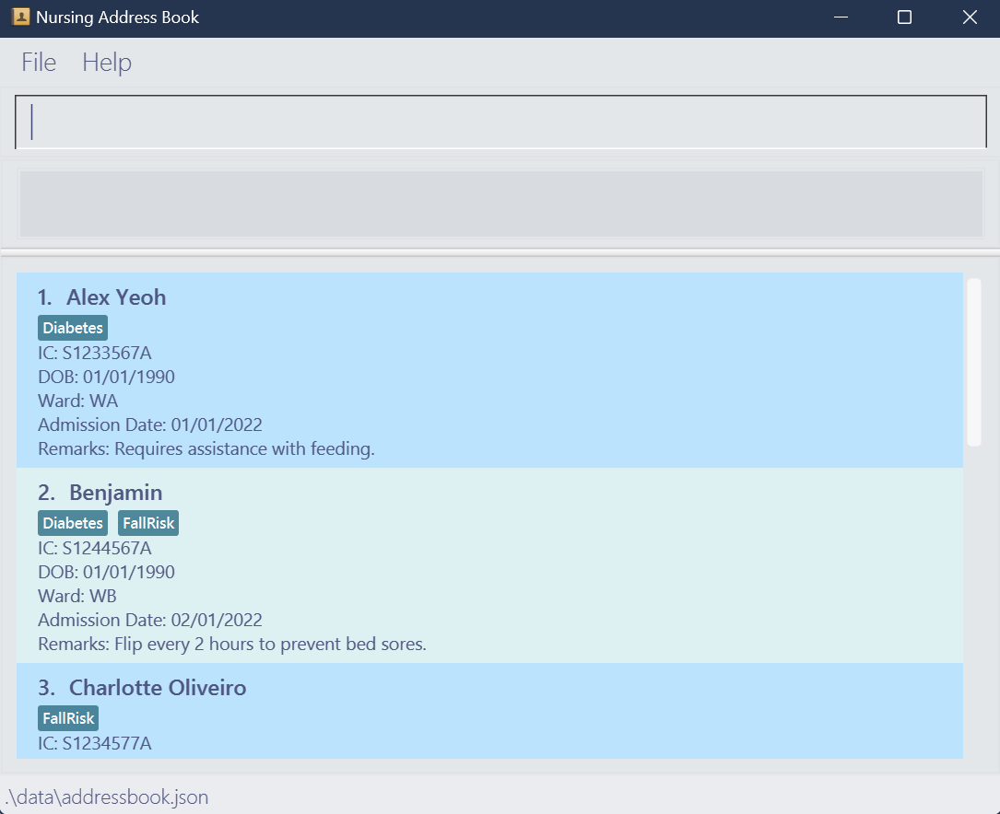
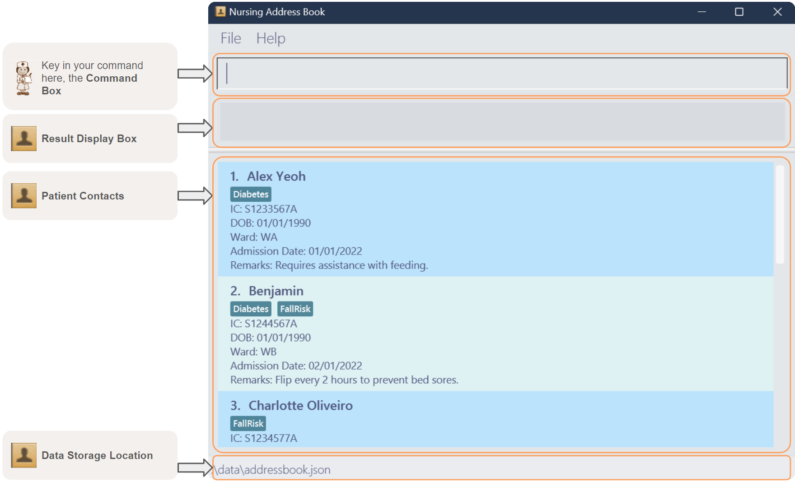
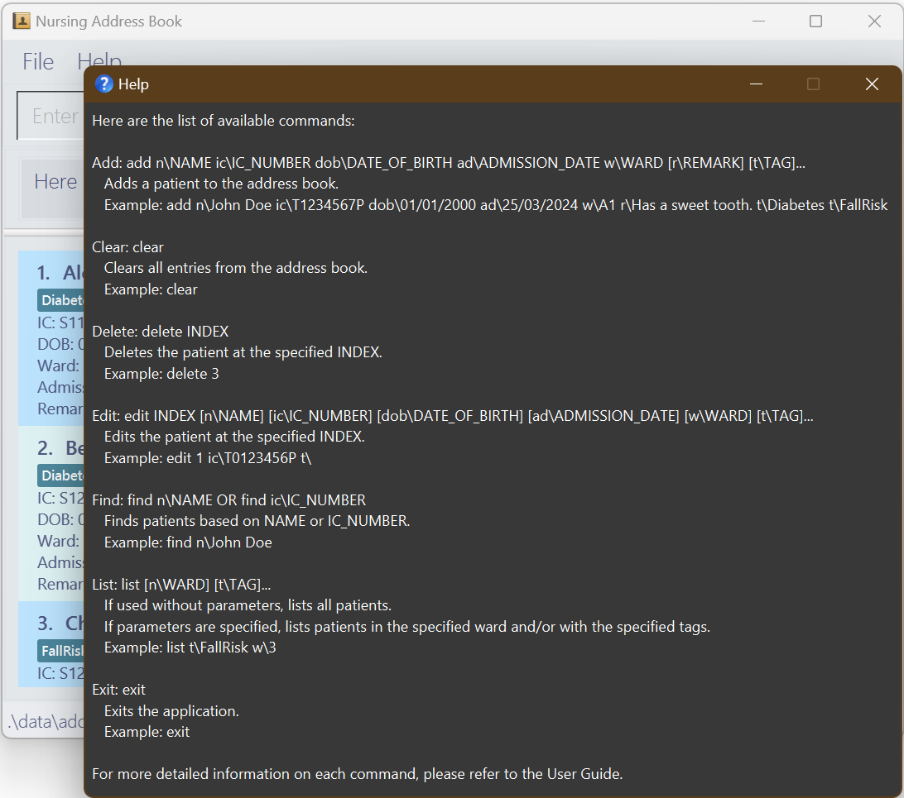
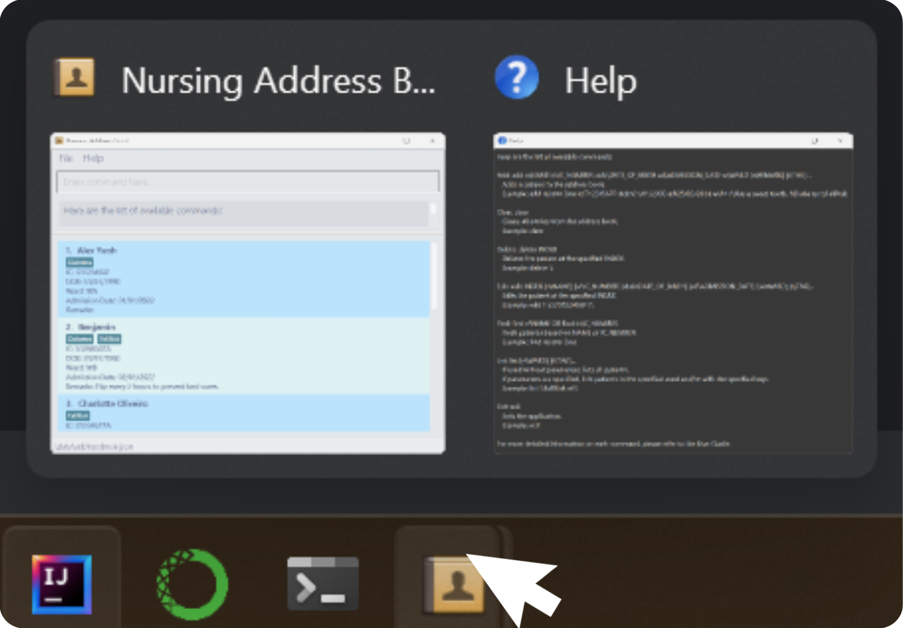

# Nursing Address Book (NAB)
Welcome to the user guide for Nursing Address Book (NAB)! NAB is a desktop application tailored for ward nurses in Singapore, optimizing patient contact management via a Command Line Interface (CLI) while incorporating a Graphical User Interface (GUI) for ease of use.
Designed for efficiency, NAB enables:
 - quick access to patient records, 
 - streamlined contact management, 
 - simplified logging of care details, 

proving to be a valuable tool for fast typists and those who prefer the precision of CLI operations.

If you are a new user, fret not! We have included a quick [Introduction](#introduction) to the user guide.

If you wish to get started immediately, you can skip the introduction and head straight to the [Quick Start](#quick-start) section.

If you are a current user, feel free to jump into our [table of contents](#table-of-contents) to find the section you need help with.

<div markdown="span" class="alert alert-info">
**:information_source: Note:** The Nursing Address Book (NAB) application is currently available only in English. However, we are actively working on expanding the language support, and plan to offer additional language options in future releases.
</div>

--------------------------------------------------------------------------------------------------------------------
## Table of Contents
* [Introduction](#introduction)
* [Quick Start](#quick-start)
* [The Interface](#the-interface)
* [Features](#features)
  * [Patient Management Features](#patient-management-features)
    * [Adding a patient](#adding-a-patient--add)
    * [Listing relevant patients](#listing-patients--list)
    * [Editing a patient’s details](#editing-a-patients-details--edit)
    * [Locating patient contacts](#locating-a-patients-contact--find)
    * [Deleting a patient](#deleting-a-patient--delete)
  * [General Features](#general-features)
    * [Viewing Help](#viewing-help--help)
    * [Clearing all Entries](#clearing-all-entries--clear)
    * [Exiting the Program](#exiting-the-program--exit)
    * [Saving the data](#saving-the-data)
    * [Editing the data file](#editing-the-data-file)
* [Command Summary](#command-summary)
* [FAQ](#faq)
* [Known Issues & Troubleshooting](#known-issues--troubleshooting)
* [Glossary](#glossary)

--------------------------------------------------------------------------------------------------------------------
## Introduction

This guide is designed to help you navigate Nursing Address Book (NAB) with ease. The guide is divided into several sections, 
each focusing on a specific aspect of the application. As it is meant to give comprehensive details to master the use of NAB, 
it is recommended to read through the guide sequentially. However, we acknowledge that it can be overwhelming. Do not worry, 
as you can use the [Table of Contents](#table-of-contents) to navigate to the section you need help with.

The guide is structured as follows:
1. **Quick Start**: A quick guide to get you started with NAB.
2. **The Interface**: An overview of the GUI and its features.
3. **Features**: Detailed explanations of the commands available in NAB.
4. **Command Summary**: A summary of all the commands available in NAB.
5. **FAQ**: Answers to frequently asked questions.
6. **Known Issues & Troubleshooting**: A list of known issues and solutions to common problems.
7. **Glossary**: Definitions of technical terms used in the guide.

If you are a new user, we recommend you to continue scrolling to get a better understanding of this user guide.

If you are a current user, you can skip this section and head straight to the [Features](#features) section or the 
[Command Summary](#command-summary) to hone your skills. If you encountered some trouble, be sure to look through our 
[FAQ](#faq) and [Known Issues & Troubleshooting](#known-issues--troubleshooting) sections for solutions.

Nonetheless, if you encounter any foreign terms, be sure to head to our [Glossary](#glossary)!

We hope you find this guide helpful in your journey to mastering NAB.

### Icons used in this guide
Here are the icons used in this guide and their meanings:

| Icon                          | Meaning                                                                           |
|-------------------------------|-----------------------------------------------------------------------------------|
| :exclamation:**Caution**      | Indicates a caution or warning. Typically, these are common errors made by users. |
| :information_source: **Note** | Provides additional information.                                                  |
| :bulb:**Tip**                 | Provides additional tips for you to master the application.                       |


Back to [Table of Contents](#table-of-contents)

--------------------------------------------------------------------------------------------------------------------

## Quick start

1. Ensure you have Java `11` installed in your Computer. You can find out how to identify your current Java version 
[here](https://www.java.com/en/download/help/version_manual.html#:~:text=The%20Java%20version%20can%20be%20found%20in%20the%20Java%20Control%20Panel.&text=Under%20the%20General%20tab%20in,About%20showing%20the%20Java%20version), or install Java `11` from [here](https://www.oracle.com/java/technologies/javase-jdk11-downloads.html).

2. Download the latest `nab.jar` from [here](https://github.com/AY2324S2-CS2103T-F10-1/tp/releases).

3. Copy the file to the folder you want to use as the _home folder_ for your Nursing Address Book.

4. Open a command terminal. 
   * For Windows users: Search for `cmd` in the Start menu and run it as an administrator if necessary.
   * For Mac/Linux users: Open the "Terminal" application (usually found within your Applications/Utilities folder).
5. Use the `cd` command to navigate to the folder where you placed the jar file.
6. Run the application by executing `java -jar nab.jar`.<br>
   Shortly, a GUI resembling the following should display, including some sample input to get you started:<br>
   
   <br>

   <div markdown="block" class="alert alert-info">
   **:information_source: Note for Windows users:** _Ensure you have the necessary permissions to execute commands. Running the command prompt as an administrator may be required. If you encounter permission issues on Mac/Linux, you might need to use `chmod +x nab.jar` to make the file executable._
   <br>
   Should you need help navigating the interface, refer to the [Interface](#the-interface) section.
   </div>
7. Type the command in the command box and press Enter to execute it. e.g. typing **`help`** and pressing Enter will open the help window.<br>
   Some example commands you can try:

   * `list` : Lists all patients.

   * `add n\John Doe ic\T1234567P dob\01/01/2000 w\A1 ad\25/03/2024` : Adds a patient named `John Doe` to the Address Book.

   * `delete 3` : Deletes the 3rd patient shown in the current list.

   * `exit` : Exits the app.

8. Refer to the [Features](#features) below for details of each command.

Back to [Table of Contents](#table-of-contents)

--------------------------------------------------------------------------------------------------------------------
## The Interface


The main window of NAB is separated into the following sections:
1. **Command Box**: This is where you can input commands to interact with the application. Press `Enter` to execute the command.
2. **Display Box**: This is where the application displays feedback for your commands (for e.g., whether it is successful, or has an error).
<div markdown="span" class="alert alert-primary">
:bulb: **Tip** You can resize the display box to your liking!
</div>   
3. **Patient Contacts**: This is where the application displays the list of patients.
4. **Data Storage Location**: This is where the application stores the data file.

Additionally, the application provides a **Help** button at the top that you can click to view the list of available commands and their formats, 
apart from the `help` command. Similarly, the **File** button allows you to exit the application apart from the `exit` command.

Back to [Table of Contents](#table-of-contents)

--------------------------------------------------------------------------------------------------------------------

## Features
The features are categorized into two main sections: 
- [**Patient Management Features**](#patient-management-features) includes commands that allow you to manage patient records.
- [**General Features**](#general-features) include commands that provide general information and functionality.

<div markdown="block" class="alert alert-info">

**:information_source: Notes about the command format:**<br>

* Words in `UPPER_CASE` are the parameters to be supplied by the user.<br>
  e.g. in `add n\NAME`, `NAME` is a parameter which can be used as `add n\John Doe`.

* Parameters in square brackets are optional.<br>
  e.g. `n\NAME [t\TAG]` can be used as `n\John Doe t\FallRisk` or as `n\John Doe`.

* Parameters with `…`​ after them can be used multiple times including zero times.<br>
  e.g. `[t\TAG]…​` can be used as ` ` (i.e. 0 times), `t\Diabetes`, `t\Diabetes t\HearingImpaired` etc.

* Parameters can be in any order.<br>
  e.g. if the command specifies `n\NAME ic\IC_NUMBER`, `ic\IC_NUMBER n\NAME` is also acceptable.

* Extraneous parameters for commands that do not take in parameters (such as `exit` or `help`) will be ignored.<br>
  e.g. if the command specifies `exit 123`, it will be interpreted as `exit`.

* If you are using a PDF version of this document, be careful when copying and pasting commands that span multiple lines as space characters surrounding line-breaks may be omitted when copied over to the application.
</div>

### Parameters for commands

| Parameter          | Description                                                                    | Valid Input                                                                                                                                                                                                                                                                               |
|--------------------|--------------------------------------------------------------------------------|-------------------------------------------------------------------------------------------------------------------------------------------------------------------------------------------------------------------------------------------------------------------------------------------|
| **INDEX**          | The position of a patient in the displayed list.                               | Positive integers (i.e. from 1 onwards) e.g., `1`, `2`, `3`. Should not be larger than the length of displayed list.                                                                                                                                                                      |                                                                                                                                         
| **NAME**           | The name of a patient.                                                         | Common names are generally accepted. Names should be alphanumeric, with the inclusion of the following special characters: whitespaces, `'`, `-`, `,` and `/`. e.g., `John Doe`, `Nagaratnam s/o Suppiah`.                                                                                |                                                                                                                                                                                                         
| **IC_NUMBER**      | The IC number of the patient.                                                  | A unique identification number in the format of a capital letter, followed by a 7-digit number, and ending with a capital letter. e.g., `T1234567Z`. Note that while the platform performs some level of IC validation, it is up to the user to ensure that the IC is accurate.           |
| **DATE_OF_BIRTH**  | The date of birth of a patient.                                                | The date of birth of the patient must be in the format dd/MM/yyyy. e.g., `21/03/2000`. Note that while the platform performs some level of date validation, it is up to the user to ensure that the date is accurate (not in the future, impossible dates such as 30th February etc).     |              
| **ADMISSION_DATE** | The date a patient was admitted to the ward.                                   | The admission date of the patient must be in the format of dd/MM/yyyy. e.g., `21/03/2022`. Note that while the platform performs some level of date validation, it is up to the user to ensure that the date is accurate (not in the future, impossible dates such as 30th February etc). |
| **WARD**           | The ward where a patient is located.                                           | An alphanumeric string, e.g., `A1`. Note that special characters are not allowed, and you can work around this issue by utilising CamelCase e.g., `FallRisk`.                                                                                                                             |                                                                                               
| **REMARK**         | Optional remark about a patient.                                               | Any string input, e.g., `Patient is an amputee`.                                                                                                                                                                                                                                          |                                                                                              
| **TAG**            | Optional tag to categorize a patient by health condition or other descriptors. | An alphanumeric string for each tag, e.g., `Diabetes`. Note that special characters are not allowed, and you can work around this issue by omitting special characters, utilising CamelCase e.g., `FallRisk`.                                                                             |                                                                                             

### Patient Management Features
For patient management features, NAB provides the following commands:
- [**Adding a patient**](#adding-a-patient--add): `add`
- [**Listing relevant patients**](#listing-patients--list): `list`
- [**Editing a patient's details**](#editing-a-patients-details--edit): `edit`
- [**Locating patient contacts**](#locating-a-patients-contact--find): `find`
- [**Deleting a patient**](#deleting-a-patient--delete): `delete`

Back to [Features](#features) or [Table of Contents](#table-of-contents)

#### Adding a patient : `add`

Allows you to add a new patient's information to the address book.

Format: `add n\NAME ic\IC_NUMBER dob\DATE_OF_BIRTH ad\ADMISSION_DATE w\WARD [r\REMARK] [t\TAG]…​`

<div markdown="span" class="alert alert-primary">:bulb: <b>Tip:</b>
A person can have any number of tags (including 0)
</div>

* `DATE_OF_BIRTH` : Date of birth must not be later than admission date, and not be later than the current date.
* `ADMISSION_DATE` : Admission date must not be earlier than date of birth, and not be later than the current date.
* `REMARK` : Remarks have no length limit, and each patient can only have **ONE** remark field.

Example command:

`add n\John Doe ic\T1234567P dob\21/03/2000 ad\02/02/2022 w\A1 t\FallRisk r\Requires assistance feeding. t\Diabetes`

```
New patient added: John Doe
IC: T1234567P
DOB: 21/03/2000
Ward: A1
Admission Date: 02/02/2022
Remarks: Requires assistance feeding.
Tags: [FallRisk][Diabetes]
```

#### Listing patients : `list`

Allows you to view a list of patients in the address book. 

If you use `list` command without optional parameters, you will be able to list all patients.

You may also filter by ward and/or tags to list only patients in a specific ward and/or with specific tags.

Format: `list [w\WARD] [t\TAG]...`

* `WARD` : Must only list at most **ONE** ward.
* Only patients with tags (and appropriate ward, if specified) that encompass all the provided tags will be listed.
<div markdown="span" class="alert alert-warning">
    :exclamation: **Caution:** If you wish to list all patients, utilise the command `list` instead of using empty parameters. Otherwise, it will assume that it is an invalid input.
</div>
* `list` results are permissive, meaning that specified tags will be treated as case-insensitive. Patients with tags that meet the above criteria will be listed. 
* For the `list` commands below, we assume the list contains 2 people, John Doe and Jane Doe)

Example command:
`list`
```
Listed all persons

1. John Doe
IC: T1234567P
DOB: 21 Mar 2000
Ward: A1
Admission Date: 2 Feb 2022
Remarks: 
Tags: FallRisk, Diabetes

2. Jane Doe
IC: T1234765P
DOB: 22 Apr 2000
Ward: B4
Admission Date: 3 Feb 2022
Remarks: Likes to read
Tags: FallRisk, SevereAllergies
```


`list w\B4 t\SevereAllergies`

```
Listed all persons with:
Tags: FallRisk
Ward: B4

1. Jane Doe
IC: T1234765P
DOB: 22 Apr 2000
Ward: B4
Admission Date: 3 Feb 2022
Remarks: Likes to read
Tags: FallRisk, SevereAllergies
```

#### Editing a patient's details : `edit`

Allows you to edit an existing patient's details in the address book.

Format: `edit INDEX [n\NAME] [ic\IC_NUMBER] [dob\DATE_OF_BIRTH] [ad\ADMISSION_DATE] [w\WARD] [r\REMARK] [t\TAG]…​`

* Edits the patient details at the specified `INDEX`. The index **must be a positive integer** that refers to the patient shown in the displayed list.
* You must provide at least one of the optional fields.
* Existing values will be replaced with the input values.
<div markdown="span" class="alert alert-warning">
    :exclamation: **Caution** When editing tags and/or remarks, the existing tags and/or remarks of the patient will be removed i.e adding of tags and/or remarks via `edit` is not cumulative. Be sure to copy the previous tags and remarks if you wish to retain them.
</div>

* You can remove all the patient’s tags by typing `t\ ` without specifying any tags after it.
* Similarly, you can remove all the patient’s remarks by typing `r\ ` without specifying any remarks after it.

Example command:

`edit 1 ic\T0123456P t\ r\ `

_Edits the IC_NUMBER, TAGS and REMARKS of the 1st person to be `T0123456P` for IC_NUMBER and empty for both TAG and REMARK._

The following shows the change in contact details:

**Before**:
```
John Doe
Tags: FallRisk, Diabetes
IC: T1234567P
DOB: 21/03/2000
Ward: A1
Admission Date: 02/02/2022
Remarks: Requires assistance feeding.
```
**After**:
```
John Doe
Tags:
IC: T0123456P
DOB: 21/03/2000
Ward: A1
Admission Date: 02/02/2022
Remarks:
```

#### Locating a patient's contact : `find`

Allows you to find patients whose name or IC contain any of the given keywords.

Format: `find n\NAME OR find ic\IC_NUMBER`

* The search is case-insensitive. e.g. `hans` will match `Hans`
* The order of the keywords does not matter. e.g. `Hans Bo` will match `Bo Hans`
* Only full words will be matched e.g. `Han` will not match `Hans`
* Persons matching at least one keyword will be returned (i.e. `OR` search).
  e.g. `Hans Bo` will return `Hans Gruber`, `Bo Yang`
* Only full IC will be matched e.g. `a1234567b` will not match `123`

Example command:
* `find n\John` returns `john` and `John Doe`
* `find n\alex denver` returns `Alex Denver` and `Denver Li`
* `find ic\a1234567b` returns `A1234567B`

#### Deleting a patient : `delete`

Allows you to delete the specified patient from the address book.

Format: `delete INDEX`

* Deletes the patient records at the specified `INDEX`.
* The index refers to the index number shown in the displayed list.
* The index **must be a positive integer** 1, 2, 3, …​

Example command:

`delete 2` deletes the 2nd person in the displayed list.
```
Deleted Person: Jane Doe
IC: A1234567B
DOB: 02/02/2000
Ward: A1
Admitted: 02/02/2020
Remarks: likes to go to the park
Tags: SevereAllergies
```
Back to [Patient Management Features](#patient-management-features) or [Table of Contents](#table-of-contents)

### General Features
NAB also provides the following general features:
- [**Viewing help**](#viewing-help--help): `help`
- [**Clearing all entries**](#clearing-all-entries--clear): `clear`
- [**Exiting the program**](#exiting-the-program--exit): `exit`
- [**Saving the data**](#saving-the-data)
- [**Editing the data file**](#editing-the-data-file)

Back to [Features](#features) or [Table of Contents](#table-of-contents)

#### Viewing help : `help`

Allows you to view a message explaining the available commands and their usage.

Format: `help`

On entering the `help` command, the following window will pop up:



#### Clearing all entries : `clear`

Allows you to clear all entries from the address book.

<div markdown="span" class="alert alert-warning">
:exclamation: **Caution:** This action is irreversible.
</div>

Format: `clear`


#### Exiting the program : `exit`

Allows you to exit the program.

Format: `exit`


#### Saving the data

Data from Nursing Address Book are saved in the hard disk automatically after any command that changes the data. There is no need to save manually.

#### Editing the data file

Nursing Address Book data are saved automatically as a JSON file `[JAR file location]/data/addressbook.json`. Advanced users are welcome to update data directly by editing that data file.

<div markdown="span" class="alert alert-warning"> :exclamation: <b>Caution:</b>
If your changes to the data file makes its format invalid, Nursing Address Book will discard all data and start with an empty data file at the next run. Hence, it is recommended to take a backup of the file before editing it.<br>
Furthermore, certain edits can cause the Nursing Address Book to behave in unexpected ways (e.g., if a value entered is outside of the acceptable range). Therefore, edit the data file only if you are confident that you can update it correctly.
</div>

Back to [General Features](#general-features) or [Table of Contents](#table-of-contents)

--------------------------------------------------------------------------------------------------------------------


## Command summary

| Action     | Format and Examples                                                                                                                                                                                     |
|------------|---------------------------------------------------------------------------------------------------------------------------------------------------------------------------------------------------------|
| **Add**    | `add n\NAME ic\IC_NUMBER dob\DATE_OF_BIRTH ad\ADMISSION_DATE w\WARD [r\REMARK] [t\TAG]…​` <br> e.g., `add n\James Ho ic\A1234567B dob\21/03/1999 ad\21/01/2023 w\A1 r\Can read lips. t\HearingImpaired` |
| **Clear**  | `clear`                                                                                                                                                                                                 |
| **Delete** | `delete INDEX`<br> e.g., `delete 3`                                                                                                                                                                     |
| **Edit**   | `edit INDEX [n\NAME] [ic\IC_NUMBER] [dob\DATE_OF_BIRTH] [ad\ADMISSION_DATE] [w\WARD] [r\REMARK] [t\TAG]…​`<br> e.g.,`edit 2 n\James Lee w\A2`                                                           |
| **Find**   | `find n\KEYWORD [MORE_KEYWORDS]`, `find ic\KEYWORD`<br> e.g., `find n\James Jake`, `find ic\a1234567b`                                                                                                  |
| **List**   | `list [w\WARD] [t\TAG]...`<br> e.g., `list w\B4 t\SevereAllergies`                                                                                                                                      |
| **Help**   | `help`                                                                                                                                                                                                  |

Back to [Table of Contents](#table-of-contents)

--------------------------------------------------------------------------------------------------------------------

## FAQ

**Q**: How do I transfer my data to another Computer?<br>
**A**: Install the app in the other computer and overwrite the empty data file it creates with the file that contains the data of your previous Nursing Address Book home folder.

Back to [Table of Contents](#table-of-contents)

--------------------------------------------------------------------------------------------------------------------

## Known issues & Troubleshooting

1. **When using multiple screens**, if you move the application window to a secondary screen, and later disconnect/turn off that secondary screen while the application is still open, the GUI will open off-screen on the primary screen. The remedy is to delete the `preferences.json` file created by the application before running it again.
2. **When re-accessing the help window after minimising it**, the help window may not pop up again. The remedy is to mouse over the NAB icon and click on the preview window to bring it back to the front.

3. **Empty tags cannot be listed.**  The `list` command will not display tags that do not contain any associated content. This is done to provide the most useful results.
Back to [Table of Contents](#table-of-contents)
4. **Language Support:** NAB is currently available only in English. Support for additional languages will be introduced in future releases.
5. **Slow performance**: If you experience slow performance or lag while using NAB, especially on older or low-end systems, you can try closing other running applications to free up system resources. Additionally, you can try restarting the application or your system to clear any potential memory leaks or temporary issues.

--------------------------------------------------------------------------------------------------------------------

## Glossary

| Term             | Further Explanation, Representation and Examples                                                                                                          |
|------------------|-----------------------------------------------------------------------------------------------------------------------------------------------------------|
| **Alphanumeric** | A string that must contain any of alphabetical and numerical characters only. Excludes other special characters, whitespace etc. e.g., `A1`, `T1234567P`. |
| **CamelCase**    | A naming convention where the first letter of each word is capitalized except the first word. e.g., `FallRisk`, `HearingImpaired`.                        |
| **Case-insensitive** | A search that does not differentiate between uppercase and lowercase letters. e.g., `john` will match `John`.                                             |
| **CLI**          | Command Line Interface. It is a text-based interface where you input commands to interact with the system. Perfect for fast typists like you!             |
| **Command**      | An instruction given to the application to perform a specific task. e.g., `add`, `list`, `delete`.                                                        |
| **Command Terminal** | A text-based interface where you can input commands to interact with the computer's operating system. e.g., `cmd` for Windows users.                      |
| **Data File**    | A file that stores the data of the application. e.g., `addressbook.json`.                                                                                 |
| **GUI**          | Graphical User Interface. It is the visual representation of the system you see.                                                                          |

Back to [Table of Contents](#table-of-contents)

--------------------------------------------------------------------------------------------------------------------
